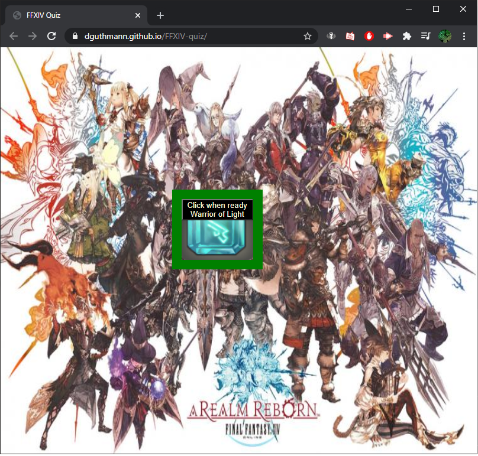

# FFXIV-quiz

### Author: David Guthmann

github: https://github.com/Dguthmann/  
livesite: https://dguthmann.github.io/FFXIV-quiz/

## List of Contents

index.html
script.js
style.css
README.md
screenshot.png

## Basic Overview of Project

The goal of the project is to make a working web api, that will quiz the user on the subject of Final Fantasy 14.  
This program will be reactive to allow a timed quiz starting on a start button and have a user interface where they can click buttons to answer questions.  
Once all questions are answered or time runs out, the user will be scored.
The user can enter their information for the past scores screen.
Writing of questions are based off of the 5.3 patch, or patch of question will be said in question.

## Screenshot of Website

## resources Used

Ffxiv Wallpaper Request Eidos Forums Picture - https://wallpapersafari.com/w/JEyFZ8

## Further Development Plans

If I have more time later, would like to have a the score be ordered by values (sorting array function).  Also would like to add local data storage with a clear scores function.

## Changelog

2020-09-15: Bug fixing styling, and fixing end score function, CSS Styling, Question inputting, stopping double submission
2020-09-14: Creation of files, coding the script.js file, multiple commits during the day as it was fleshed out and bug tested.
